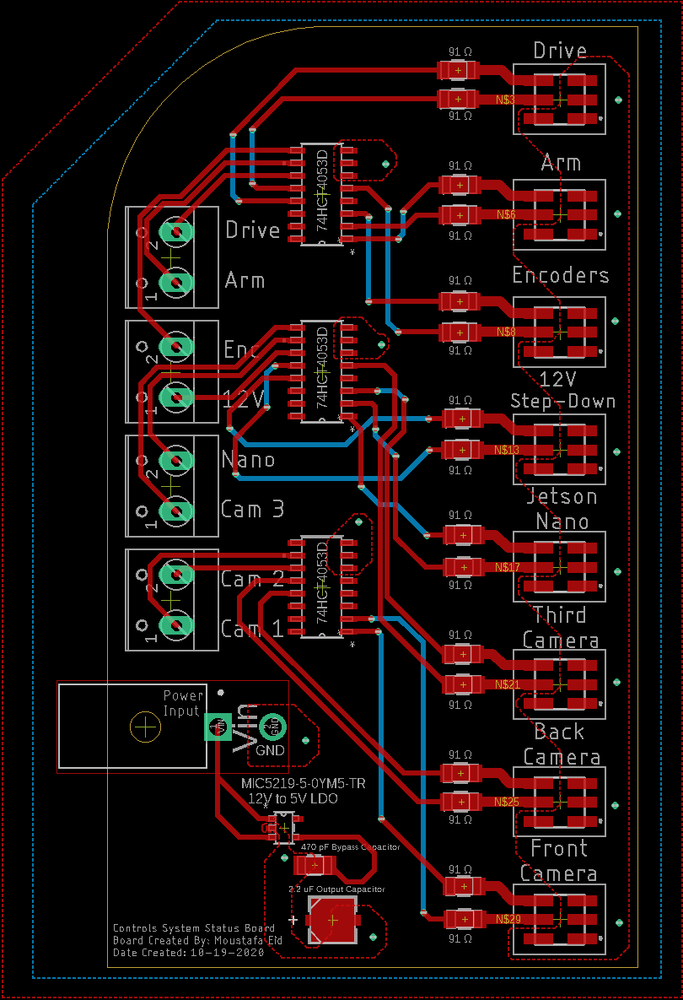

# Rover-Controls-System-Status-Board

**Objective:**

Create a LED status board to display if other boards on the rover are working. All devices wired to this board will be outputting either a high or low signal. The LED board will output a green light if the signal is high and a red light if the signal is low. Power for this led will NOT be coming from the signal, it will be coming straight from the lowered voltage which came from the 12V line). There are 8 signals that will be sent to this board. 

**Block Diagram:**

**My Process**
- Researched different RGB LED's and used the datasheets to calculate the maximum current consumption for 8 LED's. Factored in Size of LED and Visibility
- Researched and came up with a couple different options for the LED controller
  - First I looked in to using 2 NPN BJT's to act like a digital switch for the incoming signal. When the signal is high, the BJT is in saturation therefore it acts like a short circuit allowing the signal to pass. When the signal is Low, the BJT is in Cut-Off mode therefore it acts like a open-circuit and the LED is Off. 2 BJT's per LED would be used
    - I did not go with this design due to the extra amount of chips it would take and it would make the board a lot more complicated than needed
  - The second option I researched and ended up using is the Triple 2-channel analog demultiplexer IC. This is a chip that contains 3 1 to 2 Demultiplexers per chip. this is good as it reuces the amount of extra components and I would only need 3 IC's to cover 8 signals
    - The way it works is that it takes the signal as the selector and if the signal is low the input which is the 5V line would go to red and if the signal is high, the 5V input would go to green. Meaning that initially all LED's are red and once a signal is sent from the respective devices, the LED turns green
- Using all these components, I calculated the final total current consumption and chose an appropriate LDO to step-down the incoming 12V input to 5V which is spread out among the board. The LDO was chosen with double the current specifications to ensure safety and working operation all the time
- The signal is inputted to the 8 screw terminals on the PCB and the 12V input goes through the molex connector on the PCB.
- Made use of polygons to prevent overheating and created the bottom plane as the ground plane, therefore used polygons to bring the GND to the surface and connect to the components.
- The top plane was made as the 5V plane, therefore reducing the amount of wires on the board. 

**Final Design**

  

  

  

  

